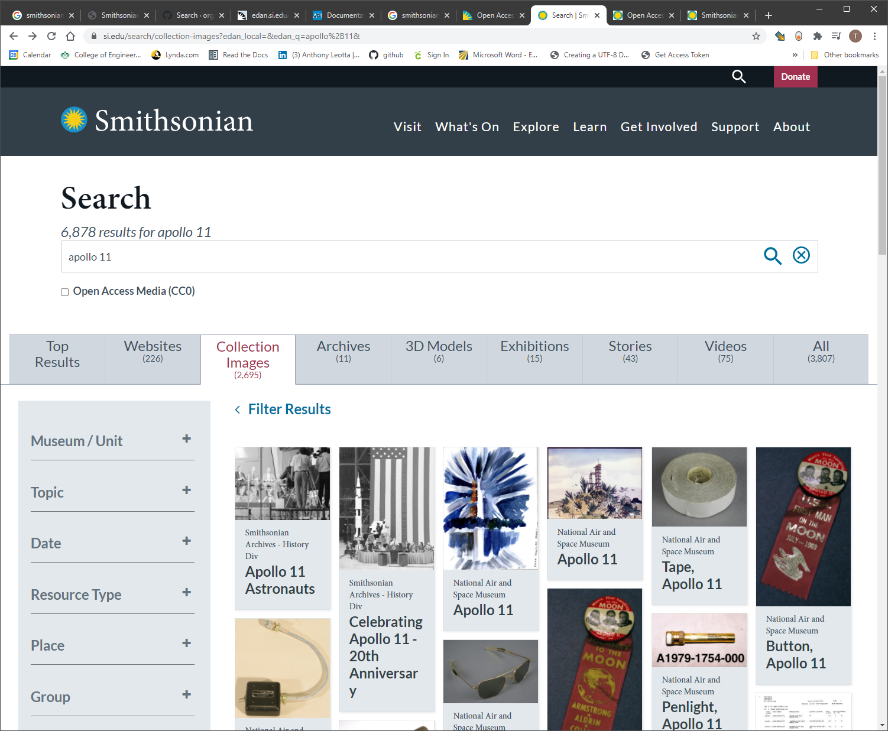
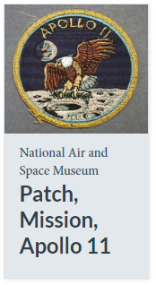
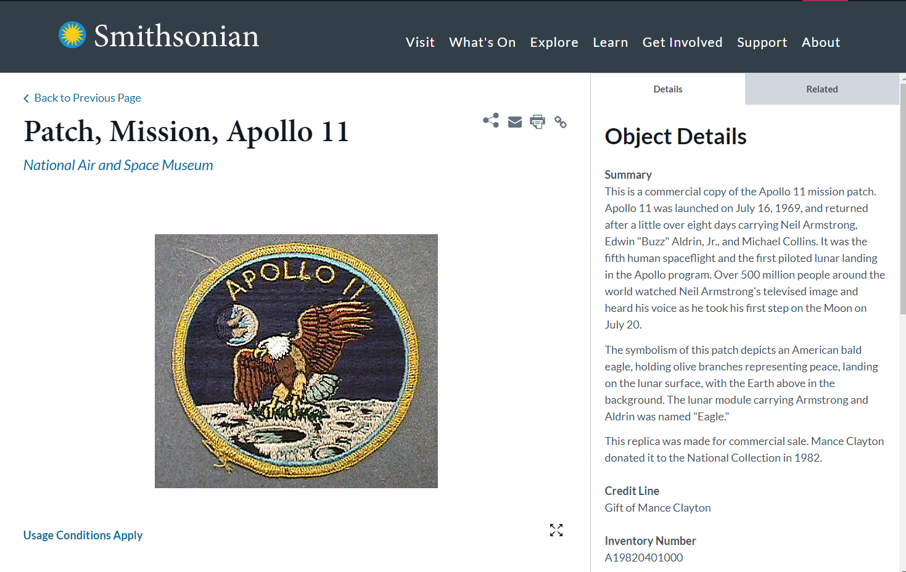
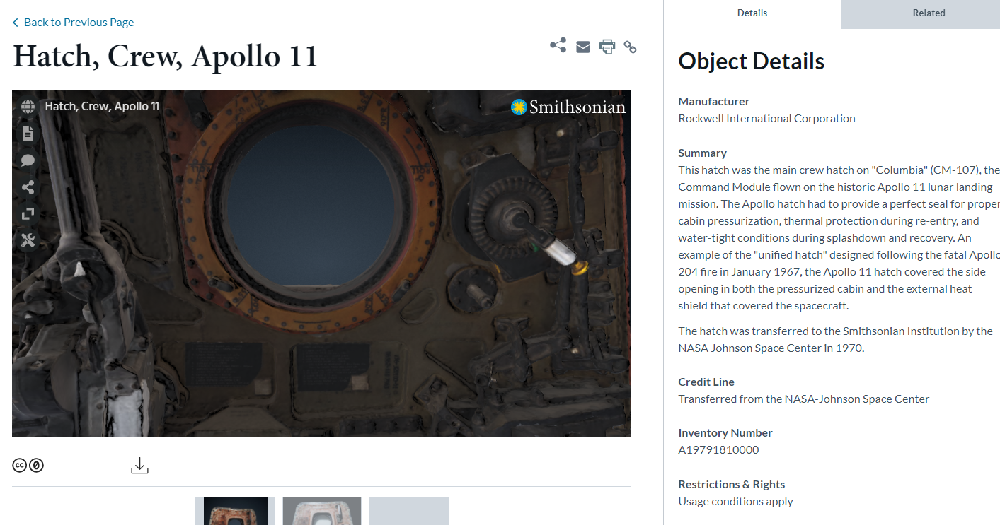

# Smithsonian Open Access API Proof of Concept

## Roadmap and Features

This section details the current features of this POC and the roadmap for new features.

| Feature Name                                    | Feature Description                                          | Branch                     | Status      |
| ----------------------------------------------- | ------------------------------------------------------------ | -------------------------- | ----------- |
| [keep_api_key_secret](./keep_api_key_secret.md) | Key Smithsonian Open Access API secret.                      | develop                    | Merged      |
| get_category_terms                              | Use Smithsonian Open Access API to fetch an array of terms based term category | feature/get_category_terms | Merged      |
| get_content                                     | Use Smithsonian Open Access API to fetch content by id.  May have to combine a search  API call.  It would be nice to download a image and save it locally. | feature/get_content        | In Progress |

## Using the API

git The Smithsonian has a web based search interface located at https://www.si.edu/collections.  As a test I will search for Apollo 11.



Which yields many images, but I am interested in the Apollo 11 Mission patch.



When you click on the Mission Patch your taken to a content page : https://www.si.edu/object/patch-mission-apollo-11:nasm_A19820401000?edan_local=&edan_q=apollo%2B11&destination=/search/collection-images&searchResults=1&id=nasm_A19820401000



The right hand side displays information about the Mission Patch Item:

| Key                                    | Value                                                        |
| -------------------------------------- | ------------------------------------------------------------ |
| Credit Line                            | Gift of Mance Clayton                                        |
| Inventory Number                       | A19820401000                                                 |
| Restrictions & Rights                  | Usage conditions apply                                       |
| Type                                   | MEMORABILIA-Events                                           |
| Materials                              | Synthetic Fabric                                             |
| Dimensions                             | 3-D (Patch): 10.2 × 0.2cm (4 × 1/16 in.)<br />Storage: 17.8 × 15.2 × 0.6cm (7 × 6 × 1/4 in.) |
| Country of Origin                      | United States of America                                     |
| See more items in                      | National Air and Space Museum Collection                     |
| Record ID                              | nasm_A19820401000                                            |
| Usage of Metadata (Object Detail Text) | Not determined                                               |
| GUID (Link to Original Record)         | http://n2t.net/ark:/65665/nv917ded645-537d-4e3a-9eef-cd4b02d133f5 |


Next, I'll see what happens when I use the imtem title that was returned from the "Search Collection Images" web page:

```python
import search

results = search.search('Patch, Mission, Apollo 11')

```

This search actually returns 28 items, but id nasm_A19820401000 is not one of them.  I'll try searching for "Apollo 11 Mission Patch" next.

```python
import search

results = search.search('Apollo 11 Mission Patch')

```
This search returns the same results.  Next I'll try the inventory Id "A19820401000".

```python
import search

results = search.search('A19820401000')

```

This search returns no results: 

```json
{
    "status": 200,
    "responseCode": 1,
    "response": {
        "rows": [],
        "rowCount": 0,
        "message": "no results found"
    }
}
```

Searching for the record if of "nasm_A19820401000" also returns nothing.

Next I'll try searching "Hatch, Crew, Apollo 11".




## Running

```
conda activate smith
cd smith-api-poc
python main.py
```

## Setup

1. get an APi Key

    [API KEY](https://api.data.gov/signup/)

1. Download and install Anaconda Python

    Follow the offical instructions:

    - [Installation](https://docs.anaconda.com/anaconda/install/)
    - [Installing on Windows](https://docs.anaconda.com/anaconda/install/windows/)
    - [Installing on macOS](https://docs.anaconda.com/anaconda/install/mac-os/)

1. Create a new anaconda Environment

    ```
    conda create --name smith python=3.8
    ```

1. Activate Anaconda Environment

    ```
    conda activate smith
    ```

1. Add PIP Requirements

    ```
    cd smith-api-poc
    pip install -r requirements.txt
    ```